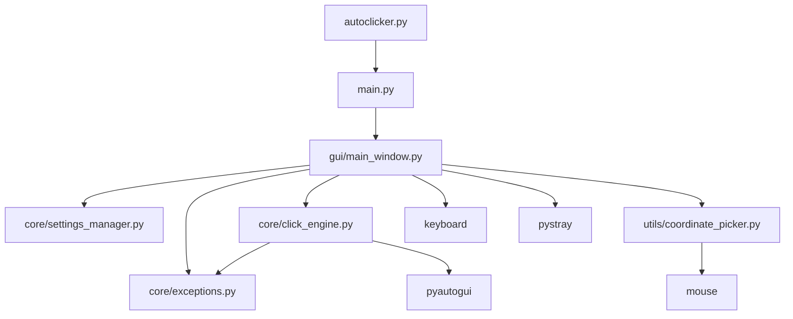

# Audit report (phase 1)

Status: Pre-fix deep dive. Factual findings for the refactor pass.

Handoff context: [audit/PRE_AUDIT_NOTES.md](audit/PRE_AUDIT_NOTES.md) and [audit/HARDENING_SUMMARY.md](audit/HARDENING_SUMMARY.md) capture the hardening baseline (28 passed, 15 failed with deps installed, 27% coverage).

---

## 1. Repo map

| Module | Role |
|--------|------|
| [autoclicker.py](autoclicker.py) | Root CLI shim to `autoclicker.main:main` |
| [autoclicker/main.py](autoclicker/main.py) | Instantiates `AutoclickerApp`, runs Tk mainloop |
| [autoclicker/gui/main_window.py](autoclicker/gui/main_window.py) | Tk UI, hotkeys, tray, engine wiring (~587 lines) |
| [autoclicker/core/click_engine.py](autoclicker/core/click_engine.py) | Threaded click loop, optional queue, metrics |
| [autoclicker/core/settings_manager.py](autoclicker/core/settings_manager.py) | JSON load/save, validation, sanitization |
| [autoclicker/core/exceptions.py](autoclicker/core/exceptions.py) | Typed errors and user-facing message helpers |
| [autoclicker/utils/coordinate_picker.py](autoclicker/utils/coordinate_picker.py) | Mouse-hook coordinate pick, presets via settings |
| [autoclicker/__init__.py](autoclicker/__init__.py) | Package version metadata |

Hotspots: `main_window.py` (UI + orchestration), `click_engine.py` (threading + hot path), `settings_manager.py` (validation contract).

---

## 2. Correctness findings

| ID | File:line | Symptom | PRE_AUDIT ref |
|----|-----------|---------|---------------|
| C1 | `click_engine.py:262-265`, `249-250` | With `enable_queuing=True`, `_perform_click` returns after enqueueing but `_perform_burst` still increments `click_count`. Limits and metrics desync from real clicks. | - |
| C2 | `click_engine.py:172` | Queue processor calls `_perform_click` while queuing is enabled, so items are re-queued and never executed via pyautogui. | - |
| C3 | `settings_manager.py:97-137` | `validate_clicks`, `validate_minutes`, `validate_variation` compare types without coercion; non-numeric strings raise `TypeError` instead of `(False, reason)`. | Section 2 (15 failures) |
| C4 | `exceptions.py:28-35`, `37-42`, etc. | Several subclasses store `reason` only in `details` string, not as `.reason`. Tests and `create_user_friendly_error` expect `.reason`. | Section 2 |
| C5 | `exceptions.py:12-14` | `AutoclickerError` sets `details` to `""` when omitted; tests expect `None`. | Section 2 |
| C6 | `tests/test_settings_manager.py:65-70` | `validate_coordinate` returns `(bool, str)` but tests use `assertFalse(tuple)`; non-empty tuple is truthy in Python. | Section 2 |
| C7 | `coordinate_picker.py:41`, `56` | `mouse.on_button` returns a hook handle; `mouse.unhook(self._on_mouse_click)` passes the callback. Hooks may leak. | - |
| C8 | `coordinate_picker.py` (whole) | No ESC or right-click cancel while picking; `on_cancelled` only from `stop_picking`. | - |
| C9 | `main_window.py:567` | `quit_application` calls `settings.update({})`, which does not read UI fields; changes since load are lost on exit. | - |
| C10 | `exceptions.py:117-122` | `create_user_friendly_error(CoordinateError)` accesses `error.reason` which does not exist on `CoordinateError`. | Section 2 |
| C11 | `settings_manager.py:183-186`, `213-216` | Invalid `interval_unit` is sanitized to `'ms'` in `sanitize_input` before `validate_interval`, so invalid units never surface as errors. | - |
| C12 | `click_engine.py:223-226` | `_click_loop` catches broad `Exception`, prints, and still invokes `on_click_complete`, masking failures. | - |

---

## 3. Test gap analysis

From [audit/baseline_htmlcov/](audit/baseline_htmlcov/) (post-hardening, deps installed):

| Module | Coverage | Gap |
|--------|----------|-----|
| `click_engine.py` | 0% | No unit tests for burst, stop conditions, queue, metrics |
| `main_window.py` | 0% | No GUI integration tests |
| `main.py` | 0% | No import/startup smoke test |
| `coordinate_picker.py` | ~2-78% | Partial; hook lifecycle untested |
| `exceptions.py` | ~95% | Subclass API mismatches still tested incorrectly |
| `settings_manager.py` | ~92-93% | Tuple API misuse in tests |

---

## 4. Performance findings

Hot path: `_click_loop` -> `_perform_burst` -> `_perform_click` -> `pyautogui.moveTo` / `pyautogui.click`.

- `pyautogui.PAUSE = 0` helps but each call still has Python wrapper overhead.
- `get_performance_metrics` recomputes `statistics.mean/median/stdev` over up to 1000 deque entries on every read.
- Queue mode adds deque append and a busy-wait processor thread (`sleep(0.001)` loop) without delivering clicks (C2).
- `_last_click_xy` skips repeat `moveTo` but first click and coordinate changes still pay full move cost.

---

## 5. Safety findings

| Item | Location | Note |
|------|----------|------|
| FAILSAFE off | `click_engine.py:19` | `pyautogui.FAILSAFE = False` at import; corner escape disabled globally |
| No runaway guard | `click_engine.py` | No measured CPS ceiling or auto-stop on anomaly |
| No session log | README claims activity logging | No file append under AppData or elsewhere |
| Silent hotkey/tray failure | `main_window.py:317-318`, `337-338` | `print` only; user sees normal UI |
| CWD settings | `settings_manager.py:32` | `autoclicker_settings.json` in process CWD; breaks for packaged/shortcut launches |
| Click limits | `click_engine.py:231` | `max_clicks` checked against inflated count when queuing (C1) |

---

## 6. Code quality (beyond lint backlog)

See [audit/PRE_AUDIT_NOTES.md](audit/PRE_AUDIT_NOTES.md) section 1 for ruff/mypy items deferred with per-file ignores.

Additional notes:

- Unused `sanitized` dict in `validate_all_settings` (`settings_manager.py:196`).
- Unused imports flagged: `Optional`, `time`, `threading` in production modules.
- `PresetManager` duplicates exception handling via bare `print`.
- `ClickEngine.get_performance_metrics` mutates returned dict with computed keys on a shallow copy of nested deque.

---

## 7. Documentation findings

| README claim | Reality |
|--------------|---------|
| Click Engine / GUI Integration tests | Only settings, exceptions, coordinate_picker tests exist (PRE_AUDIT section 4) |
| Activity logging | No implementation |
| Cross-platform | Windows-only deps (`pywin32`, tray, hotkeys) |
| `run_autoclicker.bat` Python 3.8+ | Project requires 3.10+ |

---

## 8. Dependency findings

- [requirements.txt](requirements.txt): loose `>=` pins for end users.
- [requirements-lock.txt](requirements-lock.txt): 14 packages; generated on 3.13 locally during hardening (CI uses 3.11).
- Runtime stack: pyautogui pulls MouseInfo, PyScreeze, etc.; all declared in lock.
- No GPL packages detected in lock.
- `pywin32` present but lightly used in application code today (room for Win32 hot path without new runtime dep).

---

## 9. Additional findings

- `enable_click_queuing` can be toggled from GUI while running; processor thread lifecycle is fragile.
- `coordinate_picker._on_coordinate_picker_cancelled` exists but no input path triggers cancel except failed pick.
- CI allows test failures via `continue-on-error` until phase 8 of deep dive.

---

## Repro tests added (phase 1)

See [tests/test_audit_regressions.py](tests/test_audit_regressions.py). These target findings not already covered by the 15 baseline failures.
