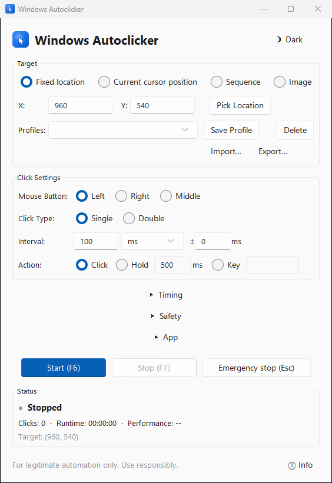
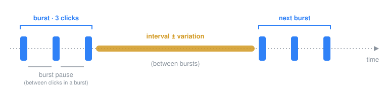

<div align="center">


# Windows Autoclicker

**A fast, careful autoclicker for Windows: pick a spot, set the pace, press F6.**

Pixel-precise clicking with burst mode, timing variation, named presets and global hotkeys,<br />
built around safety stops that are on by default.

<br />

[](https://github.com/TMHSDigital/autoclicker/releases/latest/download/WindowsAutoclicker.exe)

<sub>Single <code>.exe</code> · no install, no Python · Windows 10 and 11 · <a href="https://github.com/TMHSDigital/autoclicker/releases">all releases</a></sub>

<br />
<br />

[](https://github.com/TMHSDigital/autoclicker/actions/workflows/ci.yml)
[](https://github.com/TMHSDigital/autoclicker/releases)
[](#run-from-source)
[](#quick-start)
[](LICENSE)
[](https://github.com/sponsors/TMHSDigital)

<br />

<picture>
  <source media="(prefers-color-scheme: dark)" srcset="docs/images/screenshot-dark.png" />
  <source media="(prefers-color-scheme: light)" srcset="docs/images/screenshot-light.png" />
  
</picture>

<br />
<br />

[Quick start](#quick-start) ·
[Features](#features) ·
[How timing works](#how-timing-works) ·
[Hotkeys](#hotkeys) ·
[Safety](#safety) ·
[Settings](#settings-and-logs) ·
[Troubleshooting](#troubleshooting) ·
[Contributing](#contributing)

</div>

<br />

## Features

<table>
  <tr>
    <td width="33%" valign="top">
      <h3>Pick and click</h3>
      Click a fixed spot (type X/Y or press <b>Pick Location</b>), or click wherever the <b>cursor</b> is. Save spots as named <b>presets</b>.
    </td>
    <td width="33%" valign="top">
      <h3>Precise timing</h3>
      Intervals in milliseconds or seconds, down to <b>0&nbsp;ms</b>, with optional <b>± variation</b> so the cadence isn't perfectly regular.
    </td>
    <td width="33%" valign="top">
      <h3>Burst mode</h3>
      Fire several clicks in quick succession, then wait the interval. Left, right or middle button; single or double click.
    </td>
  </tr>
  <tr>
    <td width="33%" valign="top">
      <h3>Safety on by default</h3>
      Corner failsafe, emergency stop, click and time limits, a runaway-speed guard, and an optional pause when your target window loses focus.
    </td>
    <td width="33%" valign="top">
      <h3>Global hotkeys</h3>
      <kbd>F6</kbd> start, <kbd>F7</kbd> stop, <kbd>Esc</kbd> emergency stop. They work while the app is in the background, and a tray menu does the same.
    </td>
    <td width="33%" valign="top">
      <h3>Remembers you</h3>
      Light and dark themes, and every setting is saved to your profile and restored on next launch.
    </td>
  </tr>
</table>

## Quick start

<table align="center">
  <tr>
    <td align="center" width="25%"><h3>1</h3><b>Download</b><br /><sub><a href="https://github.com/TMHSDigital/autoclicker/releases/latest/download/WindowsAutoclicker.exe"><code>WindowsAutoclicker.exe</code></a></sub></td>
    <td align="center" width="25%"><h3>2</h3><b>Run it</b><br /><sub>no installer, no Python</sub></td>
    <td align="center" width="25%"><h3>3</h3><b>Pick a target</b><br /><sub><b>Pick Location</b>, or use the cursor</sub></td>
    <td align="center" width="25%"><h3>4</h3><b>Press <kbd>F6</kbd></b><br /><sub><kbd>F7</kbd> or <kbd>Esc</kbd> to stop</sub></td>
  </tr>
</table>

> [!NOTE]
> The executable isn't code-signed yet ([#45](https://github.com/TMHSDigital/autoclicker/issues/45)), so Windows SmartScreen may say *"Windows protected your PC"*. Choose **More info → Run anyway**. Every release is built from this repository by [CI](https://github.com/TMHSDigital/autoclicker/actions/workflows/ci.yml) when a version tag is pushed.

<details>
<summary><b id="run-from-source">Run from source</b> (Python 3.10 to 3.13)</summary>

<br />

```bash
git clone https://github.com/TMHSDigital/autoclicker.git
cd autoclicker
run_autoclicker.bat
```

`run_autoclicker.bat` creates a `.venv`, installs the pinned dependencies from `requirements-lock.txt` and starts the app. To do it by hand:

```bash
python -m venv .venv
.venv\Scripts\activate
pip install -r requirements-lock.txt
python autoclicker.py
```

</details>

## How timing works

Three settings control the rhythm. With **Burst clicks** left at 1 (the default), only the interval matters: one click, wait, repeat.

<p align="center">
  
</p>

<div align="center">

| Setting | What it controls | Range |
| :-- | :-- | :-: |
| **Interval**<br /><sub>Click Settings</sub> | Wait between bursts (or between clicks, when a burst is 1 click) | 0 to 60 000 ms<br /><sub>or 0.001 to 60 s</sub> |
| **± variation**<br /><sub>Click Settings</sub> | Random offset added to each interval | 0 ms to just under<br /><sub>the interval</sub> |
| **Burst clicks**<br /><sub>Advanced</sub> | Clicks fired per burst | 1 to 100 |
| **Burst pause**<br /><sub>Advanced</sub> | Wait between the clicks *inside* a burst | 0 to 60 000 ms |

</div>

## Hotkeys

<table align="center">
  <thead>
    <tr><th align="center">Key</th><th align="left">Action</th><th align="left">Notes</th></tr>
  </thead>
  <tbody>
    <tr><td align="center"><kbd>F6</kbd></td><td>Start clicking</td><td>Same as the <b>Start</b> button</td></tr>
    <tr><td align="center"><kbd>F7</kbd></td><td>Stop clicking</td><td>Same as the <b>Stop</b> button</td></tr>
    <tr><td align="center"><kbd>Esc</kbd></td><td>Emergency stop</td><td>Halts immediately; cancels <b>Pick Location</b> if picking</td></tr>
  </tbody>
</table>

<p align="center"><sub>Hotkeys are global: they work while another window has focus. Configurable keys are tracked in <a href="https://github.com/TMHSDigital/autoclicker/issues/47">#47</a>.</sub></p>

## Safety

An autoclicker that won't stop is worse than none, so every run has more than one way out.

<table>
  <tr>
    <td width="50%" valign="top">
      <b>Stop it yourself</b>
      <ul>
        <li><b>Corner failsafe</b> (on by default): slam the mouse into a screen corner to abort. Turning it off asks for confirmation.</li>
        <li><b>Emergency stop</b>: <kbd>Esc</kbd> or the red button, from anywhere.</li>
        <li><b>Tray menu</b>: Show, Start, Stop and Exit from the notification area.</li>
      </ul>
    </td>
    <td width="50%" valign="top">
      <b>Let it stop itself</b>
      <ul>
        <li><b>Limit clicks</b>: stop after N clicks (Advanced).</li>
        <li><b>Auto-stop</b>: stop after N minutes (Advanced).</li>
        <li><b>Runaway guard</b>: stops if more than 50 clicks land in any one second (<code>max_cps_ceiling</code>, 0 turns it off).</li>
        <li><b>Pause when unfocused</b>: remembers the window in front when you start and pauses whenever it isn't; refuses to start if it can't tell.</li>
      </ul>
    </td>
  </tr>
</table>

> [!IMPORTANT]
> Use it only on software and systems you're allowed to automate, and within their terms of service. Many online games and services forbid automated input. Responsibility for how it's used rests with the user.

### Known limitations

- The corner failsafe watches the corners of the **primary monitor** only. On other monitors, use <kbd>Esc</kbd> or <kbd>F7</kbd> to stop.
- The **Pick Location** click also reaches the window underneath ([#43](https://github.com/TMHSDigital/autoclicker/issues/43)). Pick over an empty area if that matters.
- Windows blocks input from normal apps into **elevated (admin) windows**. To click into one, run the autoclicker as administrator too; otherwise there's no need to.

## Settings and logs

Everything lives in **`%APPDATA%\WindowsAutoclicker\`**. Paste that into Explorer's address bar to open it.

<div align="center">

| File | Contents |
| :-- | :-- |
| `autoclicker_settings.json` | Your settings and presets, saved when you start clicking, change the theme or presets, and on exit |
| `autoclicker.log` | Application log, rotated at 1 MB (keeps 2 backups) |
| `sessions.log` | One line per start, stop and safety event, with reason and click count |

</div>

<details>
<summary><b>All settings keys</b></summary>

<br />

| Key | Default | Meaning |
| :-- | :-: | :-- |
| `target_mode` | `"fixed"` | `"fixed"` clicks at X/Y; `"cursor"` clicks wherever the cursor is |
| `x_coord`, `y_coord` | `100` | Target position in desktop pixels; negative on monitors left of or above the primary |
| `interval` | `1000` | Wait between bursts, in `interval_unit` |
| `interval_unit` | `"ms"` | `"ms"` or `"seconds"` |
| `variation` | `0` | ± random milliseconds added to each interval |
| `mouse_button` | `"left"` | `"left"`, `"right"` or `"middle"` |
| `click_type` | `"single"` | `"single"` or `"double"`, for any button. A double click counts as one click toward limits |
| `burst_clicks` | `1` | Clicks per burst |
| `burst_pause` | `1000` | Milliseconds between clicks inside a burst |
| `max_clicks` | `0` | Stop after this many clicks; `0` = no limit |
| `auto_stop_minutes` | `0` | Stop after this many minutes; `0` = off |
| `enable_failsafe` | `true` | Corner failsafe |
| `pause_when_unfocused` | `false` | Pause while the starting window isn't in front |
| `max_cps_ceiling` | `50` | Runaway guard threshold in clicks per second; `0` = off |
| `theme` | `"light"` | `"light"` or `"dark"` |
| `presets` | `{}` | `{"Name": {"x": 800, "y": 600}}` |

An `autoclicker_settings.json` left next to the app by older versions is migrated into AppData once, automatically.

</details>

## Troubleshooting

<details>
<summary><b>Nothing happens when I press Start</b></summary>

<br />

A dialog lists any field that failed validation. Check that the coordinates are on one of your screens and that ± variation is smaller than the interval. If no dialog appears, look at the last lines of `%APPDATA%\WindowsAutoclicker\autoclicker.log`.

</details>

<details>
<summary><b>It stops after a few clicks</b></summary>

<br />

Check the status bar and `sessions.log` for the reason: a click limit or auto-stop in **Advanced**, the corner failsafe (did the cursor touch a corner?), the runaway guard (a 0 ms interval with large bursts can pass 50 clicks per second), or **Pause when unfocused** if another window came to the front.

</details>

<details>
<summary><b>Clicks don't register in one particular app</b></summary>

<br />

If that app runs as administrator, Windows blocks input from non-elevated programs; run the autoclicker as administrator as well. Some games ignore synthetic input entirely, and fast intervals may be faster than an app can react to, so try a longer interval.

</details>

<details>
<summary><b>The hotkeys don't respond</b></summary>

<br />

Another program may already own <kbd>F6</kbd>/<kbd>F7</kbd> (browsers and some games do), or an elevated window has focus. The status bar shows a message if registering the hotkeys failed at startup.

</details>

<p align="center"><sub>Still stuck? <a href="https://github.com/TMHSDigital/autoclicker/issues/new/choose">Open an issue</a> with your Windows version, the app version and the end of <code>autoclicker.log</code>.</sub></p>

## Contributing

Bug reports, fixes and docs improvements are welcome. Start with [CONTRIBUTING.md](CONTRIBUTING.md) and the [open issues](https://github.com/TMHSDigital/autoclicker/issues).

```bash
tasks.bat install   # .venv + pinned deps + dev tools   (make install in Git Bash)
tasks.bat check     # ruff, mypy and pytest             (make check)
```

<table>
  <tr>
    <td width="50%" valign="top">
      <b><a href="docs/ARCHITECTURE.md">Architecture →</a></b><br />
      Threads, the start/stop paths and why they differ, and where state lives.
    </td>
    <td width="50%" valign="top">
      <b><a href="docs/PERFORMANCE.md">Performance →</a></b><br />
      Hot-path measurements and the soak and profiling scripts.
    </td>
  </tr>
</table>

Releases are cut by pushing a `vX.Y.Z` tag; CI tests on Python 3.10 to 3.13, builds the executable and publishes it. See the [changelog](CHANGELOG.md).

<br />

<div align="center">

---

**[CC BY-NC 4.0](LICENSE)**: free to use, share and adapt for non-commercial purposes with attribution.<br />
For commercial licensing, contact [TM Hospitality Strategies](mailto:info@tmhsdigital.com).

<sub>Built by <a href="https://github.com/TMHSDigital">TMHSDigital</a> · <a href="https://github.com/sponsors/TMHSDigital">Sponsor</a> · <a href="SECURITY.md">Security</a> · Provided as is, without warranty.</sub>

</div>
